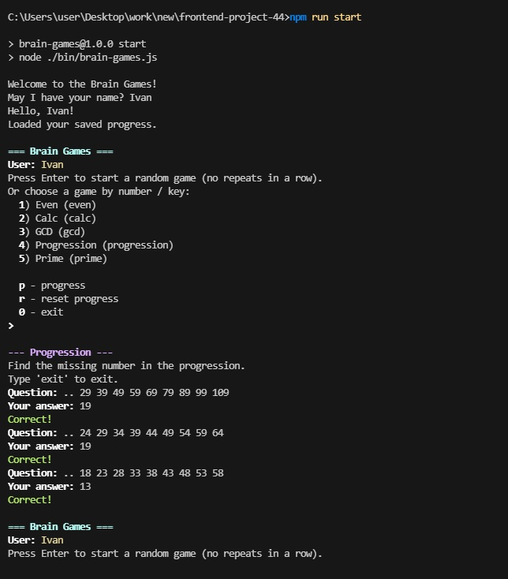
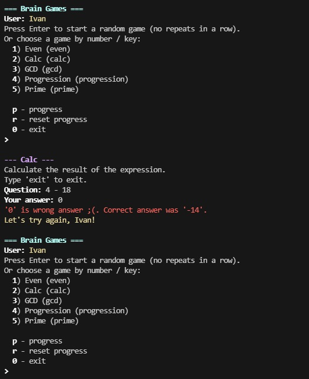
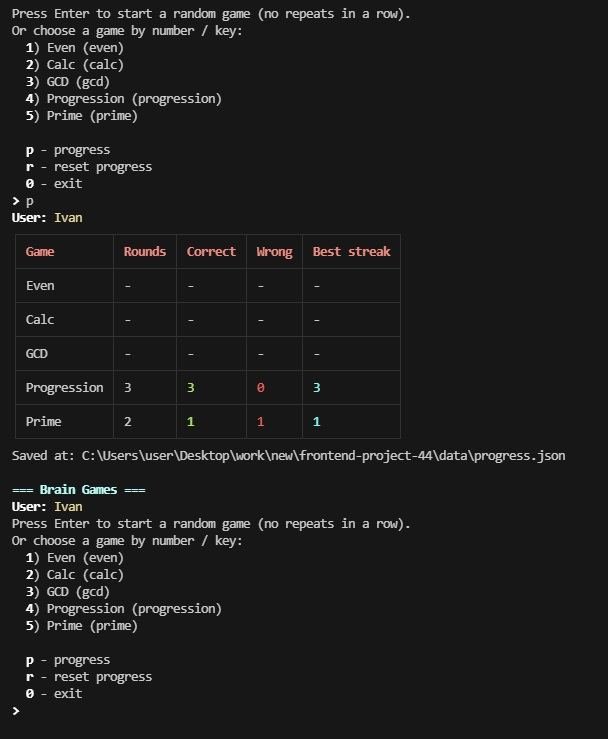

# Brain Games

[](https://github.com/LurkaBaris/frontend-project-44/actions)

[](https://sonarcloud.io/summary/new_code?id=LurkaBaris_frontend-project-44)

Консольное приложение (Node.js), представляющее собой набор из пяти простых математических игр.

`npm start` — основной вход: меню выбора мини-игры + бесконечная игра до команды выхода.
Остальные команды (`brain-even`, `brain-calc`, ...) — точки входа для тестирования конкретной игры.

## Требования

- Node.js >= 14

## Установка

В корне проекта:

```bash
npm install
```

## Запуск

Основная игра:

```bash
npm start
```

Запуск отдельной игры (для проверки):

```bash
npm run brain-even
npm run brain-calc
npm run brain-gcd
npm run brain-progression
npm run brain-prime
```

`brain-games` после ввода никнейма показывает меню:

- **Enter** — сыграть в случайную мини-игру (без повторов подряд)
- **1..5** или ключ игры (например `gcd`) — сыграть в конкретную игру
- **p** — посмотреть прогресс
- **r** — сбросить прогресс
- **0** — выйти

После каждой мини-игры (3 раунда) снова показывается это меню. В любой момент внутри игры можно ввести `exit`, чтобы выйти.

## Демонстрация

Игровой процесс (скриншоты):

**Успешное окончание игры** (три правильных ответа подряд):



**Неудачное окончание** (неверный ответ):



**Прогресс**:


## Прогресс

Прогресс сохраняется автоматически (статистика по раундам) в файл `data/progress.json`. Прогресс хранится **по никнеймам**: при старте вводишь ник — если он уже есть в файле, продолжишь с его статистикой, если нет — создастся новый профиль.
